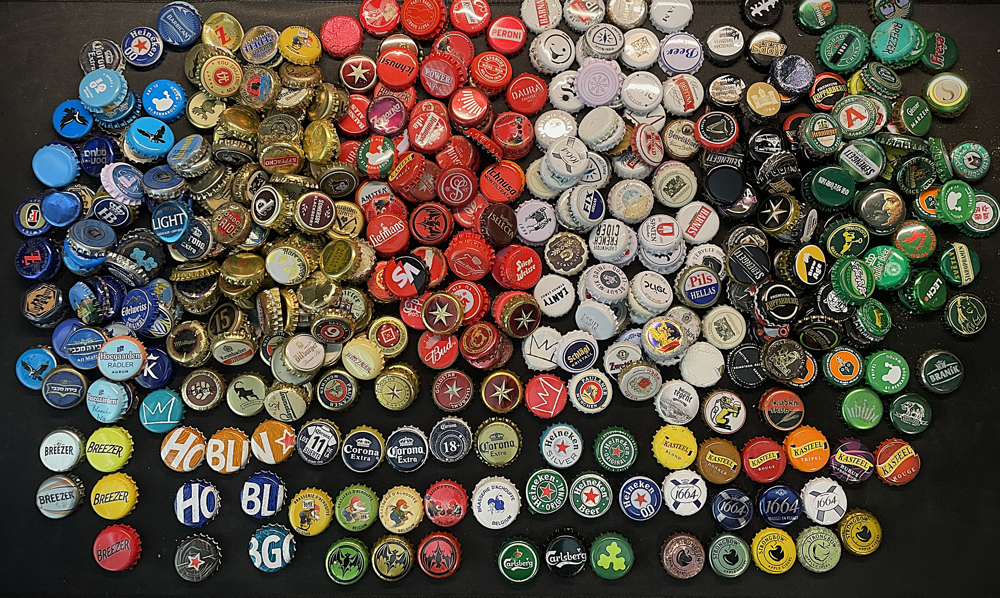
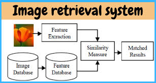
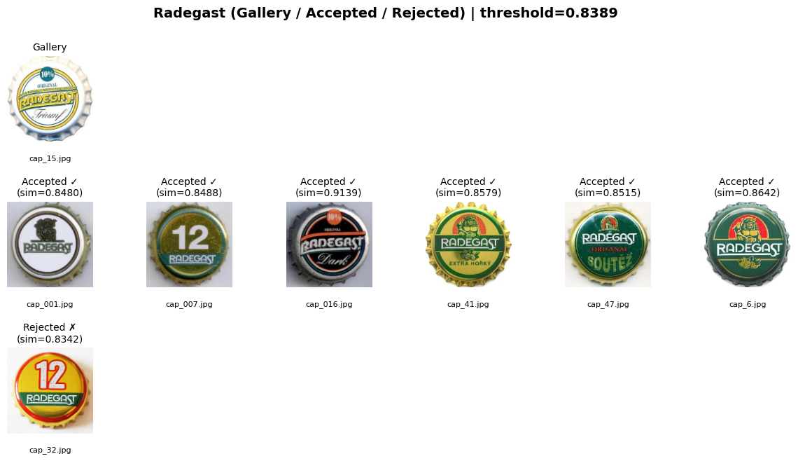
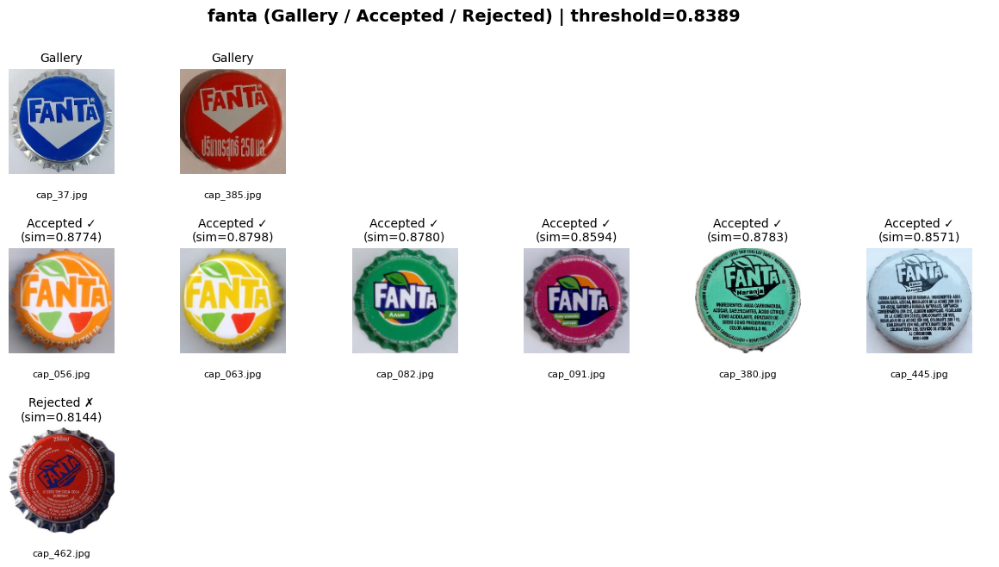
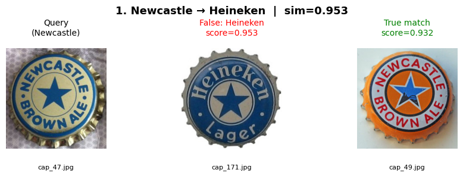
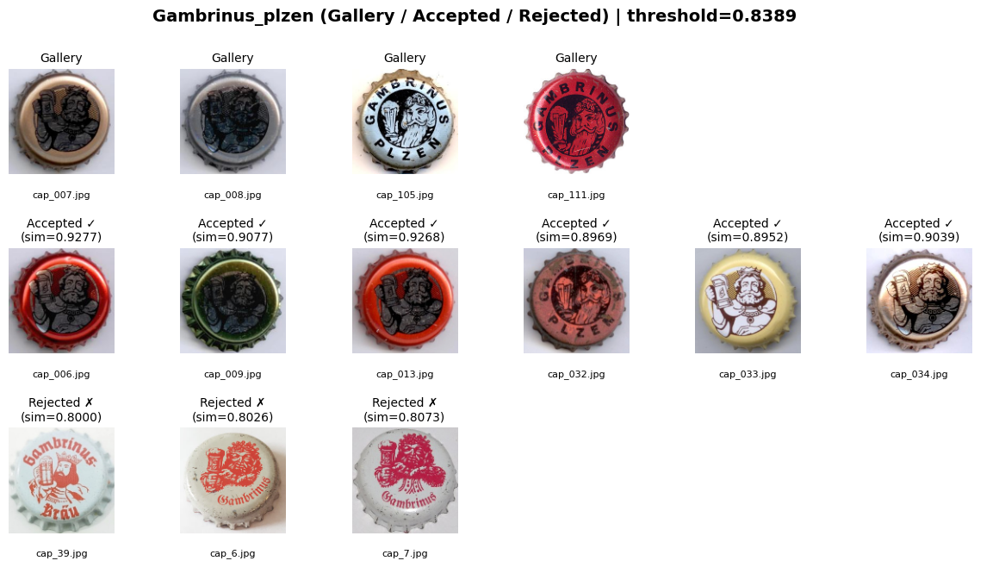
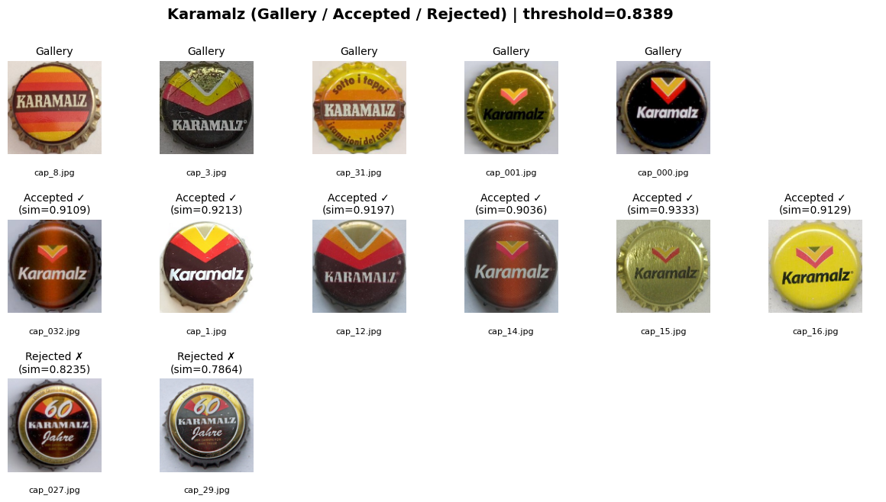
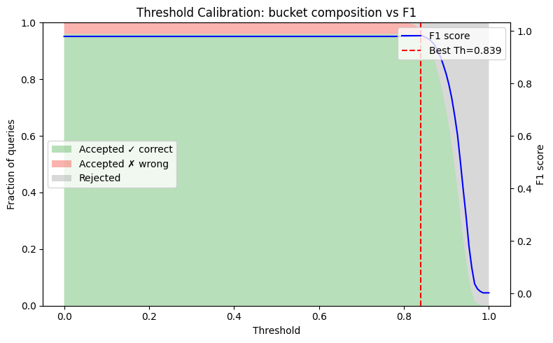
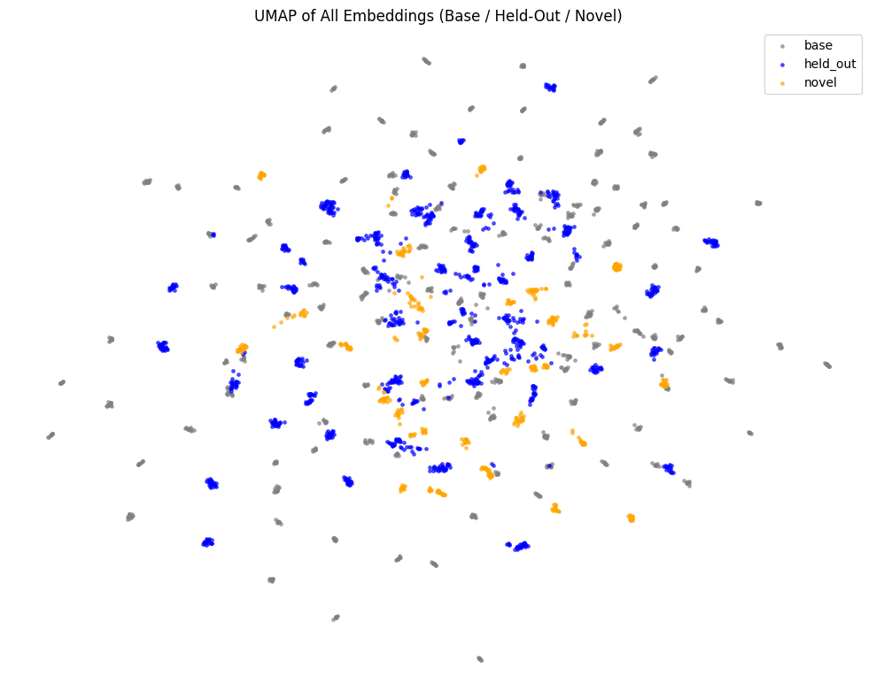
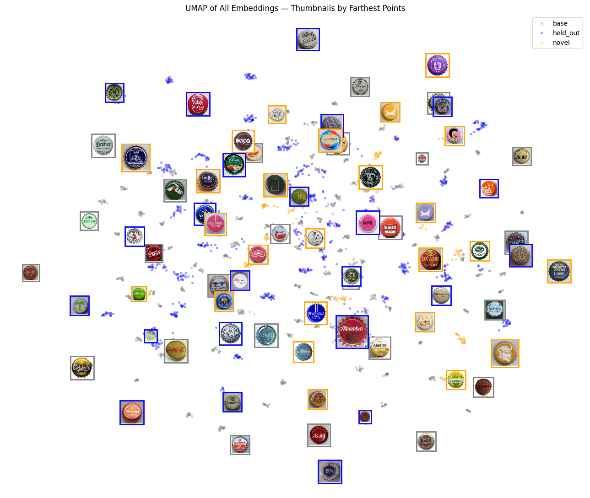

# 🍺 OpenCap -  Image Retrieval System for Beer Cap Collections

## 1. Motivation  

  
    

  

Beer cap collecting is a hobby that quickly grows complicated once a collection reaches hundreds or even thousands of items.  
Collectors face several recurring challenges:  

- **Duplicate detection** → instantly confirm whether a cap is already in the collection, avoiding mistakes and wasted storage.  
- **Faster trading** → quickly identify which caps are available for exchange, streamlining swaps between collectors.  
- **Efficient cataloging** → automate the process of tagging, sorting, and updating large collections, reducing the time spent on manual record-keeping.  

By addressing these challenges, the system helps collectors **organize their hobby more effectively**, making it easier to expand collections, trade confidently, and enjoy the experience without being slowed down by logistics.  

## 2. ⚙️ Approach

  
    

To solve the problem, I framed the task as a **metric learning–based image retrieval** problem rather than standard classification.  
Each beer cap image is encoded into a fixed-length embedding using a **ResNet-50 backbone** with **Generalized Mean (GeM) pooling**, which improves fine-grained feature aggregation compared to average pooling.  
The model is trained with a **Multi-Similarity Loss**, encouraging embeddings of the same brand to cluster tightly while pushing apart visually similar but incorrect brands.

During evaluation, embeddings from all known classes form a **gallery**. For each query image, the system retrieves the most similar gallery sample using **cosine similarity**.  
A calibrated **similarity threshold (0.8389)** determines whether a query belongs to a known brand or should be **rejected as novel**.

This setup allows:

- **Open-set recognition** — the model can reject unseen brands at inference.  
- **Incremental updates** — new brands can be added by embedding a few reference images (k-shots) without retraining.  
- **Human-interpretable inspection** — retrieval visualizations show the closest matches and per-class confusion, making errors explainable.

The final system achieves robust recall across base and held-out classes while maintaining high rejection precision for unseen brands, demonstrating its effectiveness for scalable beer-cap collection management.

---

### 🧠 Tech Stack
- **Frameworks:** PyTorch, NumPy, OpenCV, Matplotlib  
- **Modeling:** ResNet-50 backbone, GeM pooling, Multi-Similarity Loss  
- **Tools:** FAISS for retrieval, UMAP for visualization, scikit-learn for metrics  
- **Training:** Google Colab  

> **Role:** Independent project (full research, model design, data scraping, training, and evaluation by me).

## 3.🧩 Data

All images were **scraped from websites of beer cap collectors**, ensuring authentic and diverse real-world designs.  
Each image is **square-cropped on a white background**, providing a clean and standardized input format while preserving fine visual details such as typography, logos, and metallic textures.

The complete dataset contains **7,230 images** across **198 beer brands**, divided into three disjoint subsets for open-world evaluation:

| Split | Classes | Images | Purpose |
|:------|:---------|:--------|:---------|
| **Base** | 120 | 5,527 | Used for training and validation |
| **Held-out** | 50 | 1,194 | Used for closed-set testing (unseen during training) |
| **Novel** | 28 | 509 | Used for open-set testing and threshold calibration |

#### **Splitting Strategy**

- **Base split:** 80% training, 5% gallery, and 15% query images  
- **Held-out & Novel splits:** 20% gallery and 80% query images  

This design enables evaluating both **retrieval accuracy** and **novelty rejection** under realistic open-world conditions.

#### **Dataset Challenges**

1. **High intra-class variance:** samples from the same brand show large differences in color, design, and illumination, making identical brands appear as visually distinct classes.  

   

     
     
   

2. **High inter-class similarity:** many brands share fonts, color palettes, and symbols such as crowns, letters, or crests. 

    
  
      
        
    
 

3. **Fine-grained discrimination:** subtle typographic or layout differences often define the correct class.

    
  
      
        
    
 

Together, these characteristics make this dataset a strong benchmark for **fine-grained image retrieval** and **open-set recognition** in a controlled but visually challenging domain.

## 📊 Results & Evaluation

The model was evaluated on all three splits using a **global gallery** containing samples from every known brand.  
Performance was measured by retrieval metrics (Recall@K) and by coverage metrics describing how many queries were confidently accepted vs. rejected based on the calibrated similarity threshold.

### **Quantitative Results**

| Split | Support (N) | Recall@1 | Accepted (%) | Rejected (%) | Accepted-Correct (%) | Accepted-Error (%) |
|:------|:------------:|:---------:|:-------------:|:-------------:|:--------------------:|:------------------:|
| **Base** | 927 | 0.983 | 98.9 | 1.1 | 98.3 | 0.6 |
| **Held-out** | 983 | 0.918 | 95.5 | 4.5 | 91.8 | 3.8 |
| **Novel** | 418 | 0.943 | 95.9 | 4.1 | 94.3 | 1.7 |
| **All (Merged)** | **2328** | **0.948** | **97.0** | **3.0** | **94.8** | **2.2** |

> Threshold for acceptance: **0.8389 (cosine similarity)** 
<table>
  <tr>
    <td>
      
    </td>
    <td style="vertical-align: top; padding-left: 15px;">
      <b>Green</b> — Accepted + correct label: 2207 (94.80%) 
      <b>Red</b> — Accepted + wrong label: 50 (2.15%) 
      <b>Gray</b> — Rejected (no prediction): 71 (3.05%)
    </td>
  </tr>
</table>
 

 

The balanced results between coverage and recall stem from the calibrated threshold, which controls the trade-off between accepting confident predictions and rejecting uncertain ones. A higher threshold reduces false positives but increases rejections, while a lower threshold does the opposite — the chosen value achieves a stable equilibrium between accuracy and openness.

 
> The model achieves high recall on known brands while correctly rejecting unseen ones.

### **Qualitative Analysis**

**UMAP projections** show that base and held-out embeddings form compact, well-separated clusters, while novel classes appear outside the main manifold.  

  
  
    
    
  
 

  > Gray - base (gallery + queries)  
  > Blue - held out (gallery + queries)  
  > Yellow - novel (gallery + queries)  

